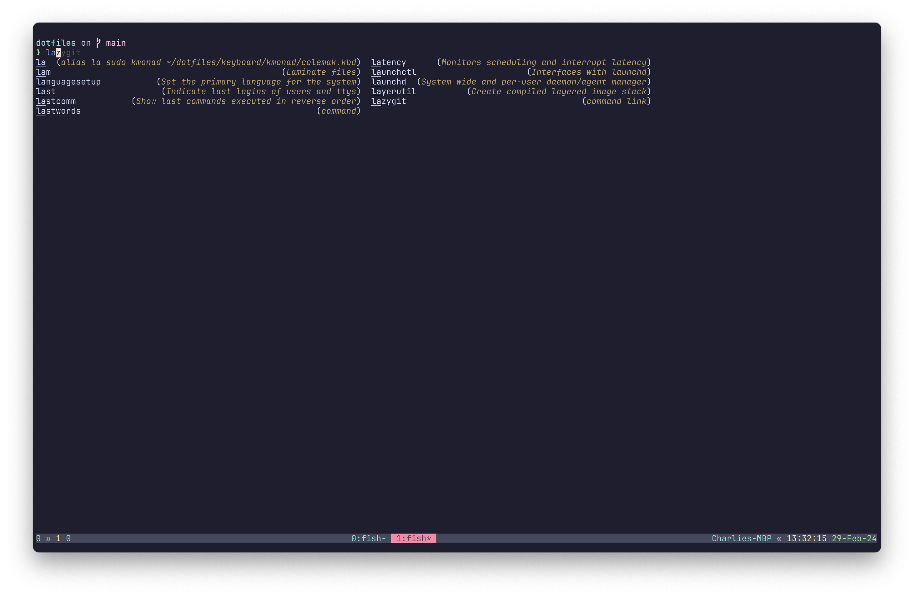
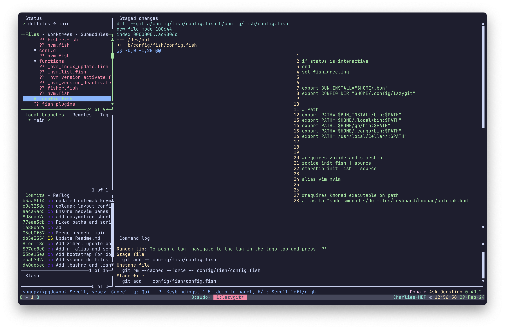
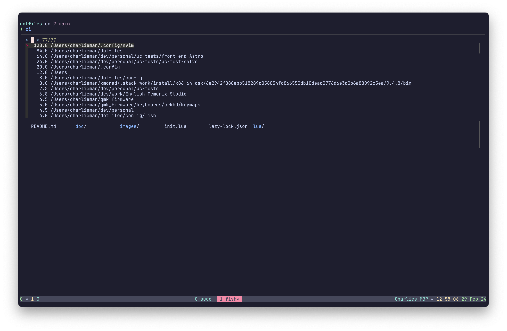

# CharlieBytex Dotfiles

Welcome to my Blazingly fast setup 🚀💨
## Tool Stack

- **Slick Shell**: Fish Shell + Starship
- **Editor**: Blazingly fast neovim, [conf](https://github.com/charlieman2700/neovim)
- **Terminal**: Wezterm and TMUX
- **Keyboard**: Corne keyboard with Colemak DH Layout, callum oneshot keys + custom shift handling code
- **Git**: Lazygit with ydiff

## Requirements

- **Req**: Lazygit, Neovim, Fish, Starship, Zoxide, Tmux (+TPM), ydiff, Wezterm
- **Optional**: Kmonad (for mapping non flashable keyboards/laptops stock keybaords)
- **Optional**: QMK for Flashing corne keyboard

## Screenshots
### Neovim

### Fish

### Lazygit

### Zoxide

